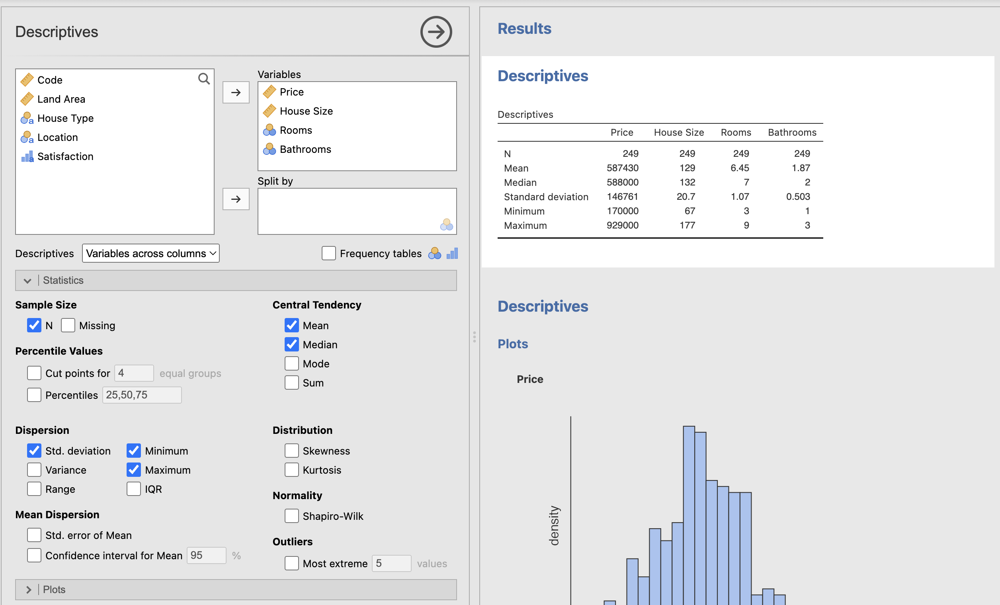
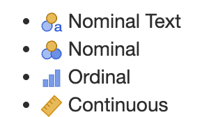
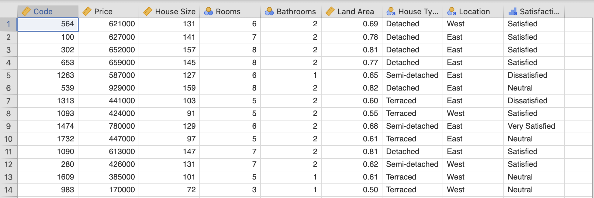
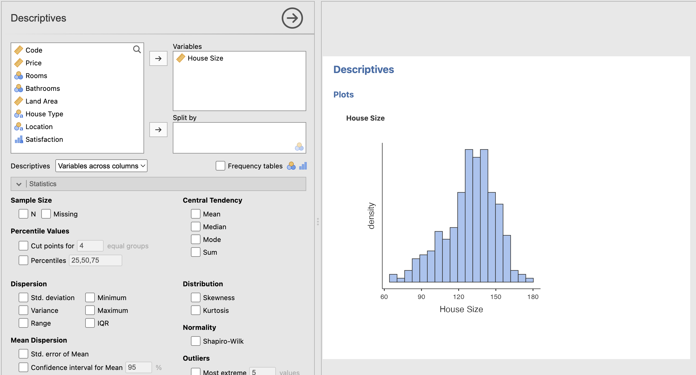
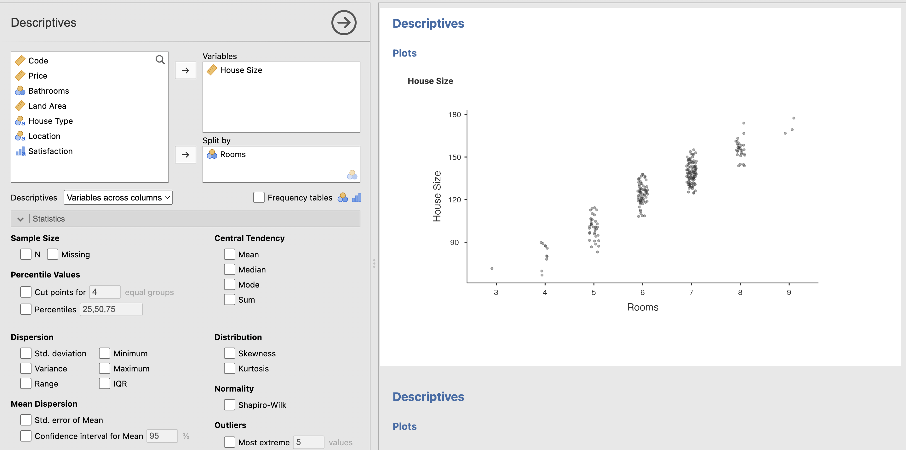
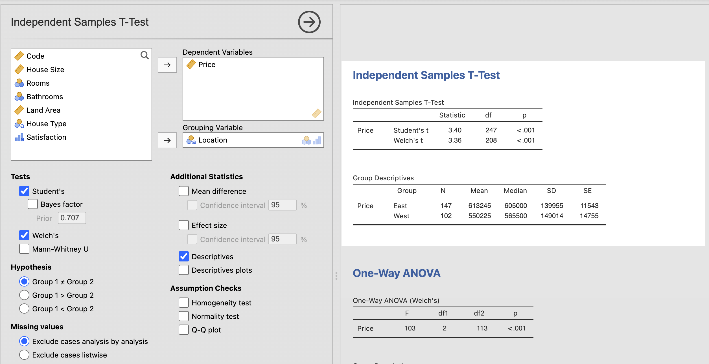
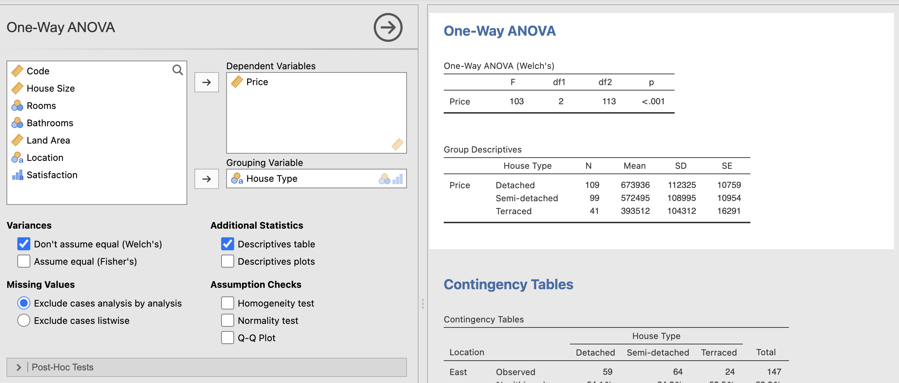
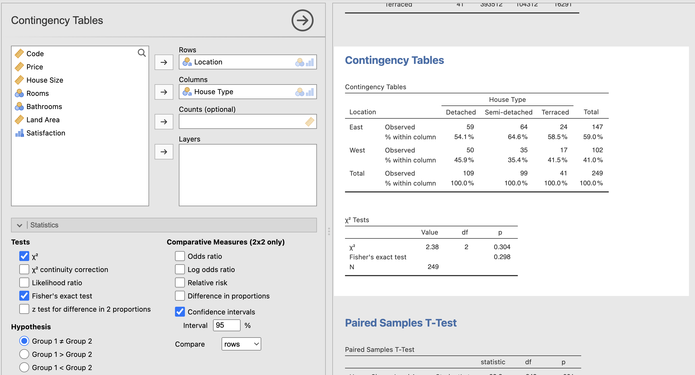
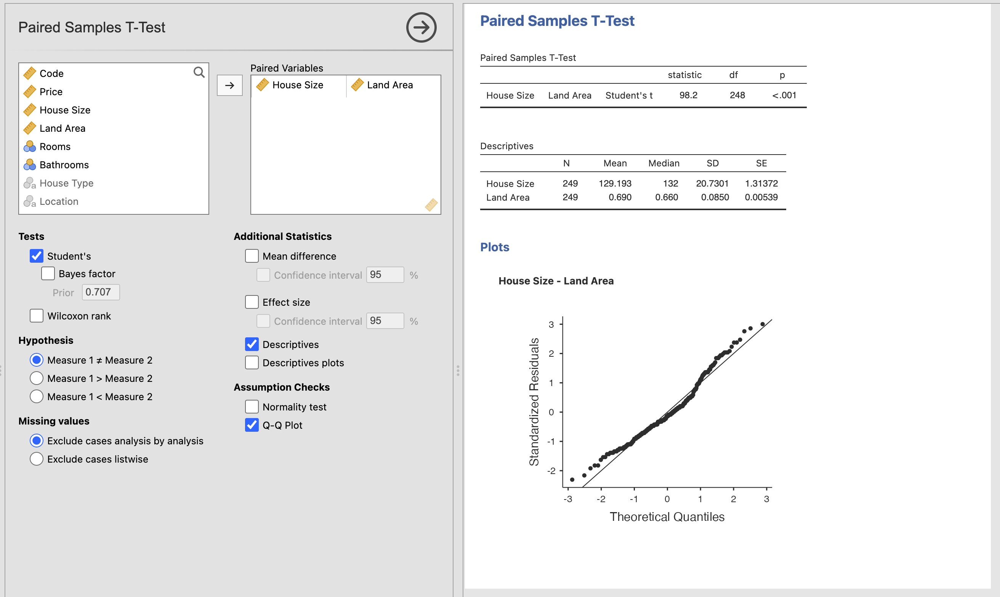
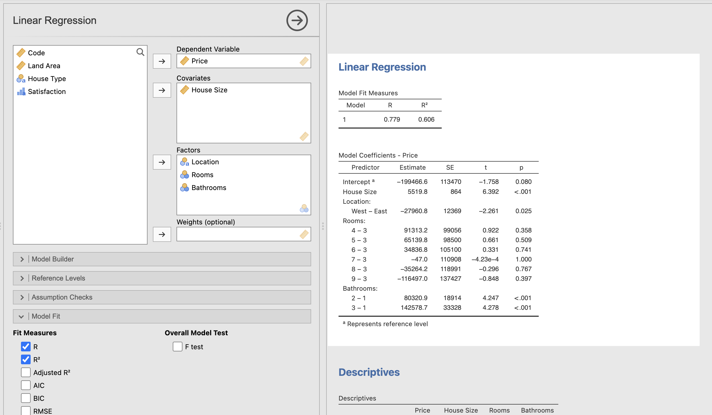

# Car Price Predictions Using Supervised Learning Models

# About

This project uses house price data given to us by our lecturer to conduct statistical anaylsis using Jamovi. Jamovi is a free and open-source statistical software designed to be an easy-to-use alternative to mainstream statistical tools such as IBMs SPSS. Built on top of the R statistical programming language, Jamovi offers a user-friendly graphical interface that simplifies data analysis for users who may not be familiar with programming.

The dataset was provided to us by our lecturer and is an Excel file containing house price data.

Taking into consideration that the user may not have access to Jamovi to understand how the statistical analysis was conducted, I have included large screenshots which demonstrate how the outputs are created. Each screenshot shows the corresponding visual created with a white background. On the left-hand side of the screenshot the user can see the input, and on the right-hand side they can see the output.

Skills Showcased

-   Statistical Understanding
-   Regression Analysis

[View more projects like this!](https://jeff-bow.github.io/)

[PDF Output of this Data!](https://jeff-bow.github.io/)

# Preparing the Data:

The data contained a possible outlier in 'house prices' that would have skewed the results of my analysis and I made the decision to remove it. I identified it as an outlier by comparing it to the mean 'house prices'. This was the only required preprocessing of the data.

# Basic Statistics: 

# Categorising the Data:

Each column of the dataset needed to be understood and categorised as either nominal, nominal text, ordinal, or continuous.

Symbols used to identify data type:

Once I interpreted the data types of each column, the dataset looked as follows:

# Univariate Statistics:

For context, univariate statistics is refering to the analysis of one variable (column) in the dataset. In this section I measured the distribution of house prices, house sizes, and the number of bathrooms in a house. It was clear that the bigger the house, the more bathrooms there were, and the more expensive it was.

Example of one distribution graph:

Example of box plot graph:

# Statistical Tests Conducted:

I then progressed into a more in-depth analysis of the dataset, looking at several different statistical tests to understand the data.

# Independent Samples T-Test:

This test compares the mean of a dependent variable (house prices) to two independent groups (location). We can conclude from this test that there is a statistically significant relationship between house price and location based on a p-value of <0.001 and we can reject the null hypothesis stating there is no relationship between these variables. 

# One-way ANOVA Test:

This test is comparing the mean of a variable between two or more independent groups. Im this case, I am comparing the price of houses (dependent) and house types. From this test we can confirm based on a p-value of <0.001 that the relationship is statistically significant and once again reject the null hypothesis. 

# Chi-square Test or Independent Samples X^2 Test:

This compares the relationship between two nominal variables, in this case location and house type. From conducting this test I was able to conclude that the relationship between these two variables is not statistically significant with a p-value of 0.304 and therefore I fail to reject the null hypothesis. 

This test does show some interesting information however, as we can see that difference in semi-detached houses in the east and west looks statistically significant. Similarly, when we look at the detached and terraced houses, we see greater numbers of these two in the east. However, looking at the percentages added into my test, we can see the figures are quite close in comparison, 54.1% in the east to 45.9% in the west for detached houses, explaining why the relationship is not statistically significant. We also break it down this way so as not to assume that there are the same number of houses in each location, which there is not. There are more houses in the east than the west, which may account for the statistically insignificant p-value.

# Assumptions from these Tests:

The independent T-test and ANOVA test assume that the data is normally distributed, which is valid for our data, except for house size, which is very slightly negatively skewed. If the variables were not normally distributed, we could use other tests such as the Mann-Whitney U test. We also have a sample size in which I removed the outlier, therefore we are assuming the sample is rid of any outliers that would affect the distribution. 

# Further analysis - Paired Samples T-Test:

From the paired sample T-Test, we pair the relationship between the mean of two variables: house size and land area. The test shows us that to 99.9%; the relationship is statistically significant between land area and house size. It is a fair assumption that the larger the house size, the larger the land area. The Shapiro-Wilk normality test confirms this. 

# Regression Model - Predicting House Prices:

I decided to use the nominal variables Number of Rooms, Number of Bathrooms, and Location for my Linear Regression model and use house size as my co-variate. This best helped me to understand the information and explain the model’s effectiveness. I also believe these variables were significant predictors for the dependent variable. I felt I could include or not include any of the variables and still provide essential data, but I did not include house type as I believe the b-value for house type could have been affected by location. 

The R-Square value is 60.6% meaning the data fit the model well. Typically, when the R-Square value is above 65%, we can conclude that the model works very well. From our House Size data, we can see that to 99.9% confidence; we can conclude that there is a strong, positive relationship between house size and price.The data tells us that to 95%+ confidence, houses in the West are indeed cheaper than in the East, by €27,960.80.

Moving on to the Number of Rooms in the house, the data output shows that the house’s value is affected positively with 4, 5 and 6 rooms compared to the baseline of 3. However, houses with 7, 8, and 9 rooms are negatively affected price-wise. With a sense check, we can see something isn’t quite right with these figures, and looking at our p-value, we can determine that the model deems these results to be statistically insignificant, and we fail to reject the null hypotheses. 

Finally, I looked at the effect of having multiple bathrooms in the house compared to just one and how this affected the house price. With a p-value of <0.001, we can conclude that the more bathrooms in the house, the higher the price of the house, with 3 bathrooms having the most significant effect on price. 

# Potential Use Case:

This information could be very useful for a real estate broker or an auctioneer, or even a quantity surveyor for an insurance company to determine the value of the house based on important contributing factors. 
